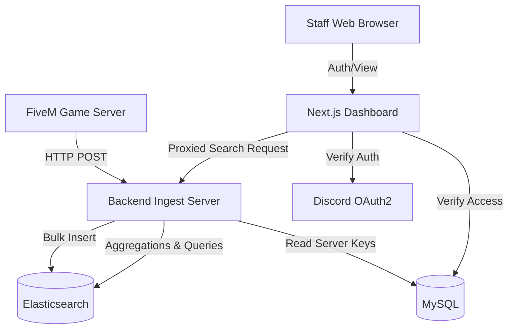

# Architecture Overview

The **FiveM Log Management System** relies on a decoupled, microservice-inspired architecture. By isolating the ingest layer from the dashboard layer, and separating search indexing from relational storage, the system achieves maximum stability and performance under heavy load.

---

## High-Level Diagram

---

## Component Breakdown

### 1. The Lua Emitter (`fivem-logging.lua`)
Operating within the FiveM server runtime, the logging resource has one responsibility: capture context and quickly flush it.
- **Non-Blocking:** Uses `PerformHttpRequest` to ensure the main server thread never stutters during logging.
- **Resilience:** If the ingest backend goes down, the Lua layer gracefully swallows errors rather than crashing the FiveM server loop.
- **Pluggable:** Standardized `exports` allow integration across any framework (ESX, QBCore, vRP).

### 2. Node.js Ingest Service
The core highway of the application. High traffic FiveM servers generate hundreds of logs a second (player movements, economy ticks).
- **Technology:** Node.js, Express, and `@elastic/elasticsearch`.
- **Security:** Verifies incoming `Authorization: Bearer <API_KEY>` against the registered server tokens in MySQL. Drops unauthorized traffic immediately.
- **Routing:** Exposes standard endpoints (`/log`, `/search`) ensuring that the database itself is never directly accessible via the public internet.

### 3. Dual-Database Paradigm
Attempting to store high-volume logs in SQL tables leads to severe performance degradation. This project utilizes two highly optimized engines for their exact intended purposes:
- **Elasticsearch (Time-Series / Logging):** Completely dynamic JSON ingest capabilities. Handles millions of full-text search string matches in under 20 milliseconds.
- **MySQL (Configuration / Relational):** Handles statically structured data such as `log_channels` configs, Discord `users`, and `user_server_access` mappings. Provides robust normalization.

### 4. Next.js Admin Dashboard
The user-facing portal built on cutting-edge React paradigms.
- **Framework:** Next.js (Server Components + App Router).
- **Authentication Strategy:** Stateless JWT verification generated locally after verifying identity with Discord. There are no server-side sessions stored in memory, making the dashboard horizontally scalable.
- **Proxy Layer:** The frontend never touches Elasticsearch directly. Search requests from users are proxied securely through Next.js API boundaries to the Ingest backend.

---

## Security Posture

1. **In-Transit Encryption:** While not built-in via the codebase natively, deploying the backend behind a reverse-proxy (NGINX/Cloudflare) easily enforces HTTPS/TLS encryption.
2. **Access Control (RBAC):** Server isolation is maintained in MySQL. Authenticated users cannot even view log channel definitions of a server they haven't been assigned to via `user_server_access`.
3. **Prevention of Query Injection:** The Elasticsearch client utilizes structured JSON query DSL. Input passed from the web is safely parameterized before hitting the DB layer.
