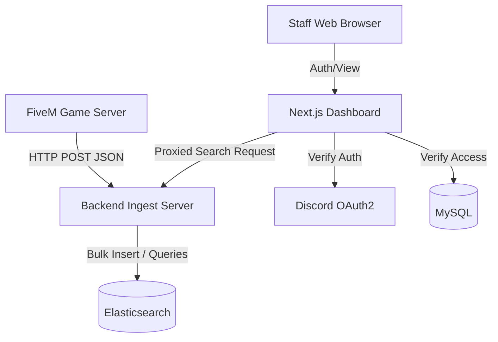

# Architecture Overview

The **FiveM Log Management System** relies on a decoupled architecture. By isolating the ingest layer from the dashboard layer, and separating search indexing from relational storage, the system achieves stability and performance under heavy load.

---

## High-Level Diagram

---

## Component Breakdown

### 1. The Lua Emitter (`fivem-logging.lua`)
Operating within the FiveM server runtime, the logging resource has one responsibility: capture context and quickly flush it.
- **Non-Blocking:** Uses `PerformHttpRequest` to ensure the main server thread never stutters during logging.
- **Resilience:** If the ingest backend goes down, the Lua layer gracefully swallows errors rather than crashing the FiveM server loop.
- **Pre-configured:** Directly points to your backend instance via internal file variables.

### 2. Node.js Ingest Service
The core highway of the application. High traffic FiveM servers generate hundreds of logs a second (player movements, economy ticks).
- **Technology:** Node.js, Express, and `@elastic/elasticsearch`.
- **Purpose:** Exposes standard endpoints (`/log`, `/search`, `/stats`) acting as a proxy layer directly into Elasticsearch.
- **Security Note:** In the current structure, the Ingest layer blindly accepts logs. It depends on network isolation (e.g., firewalling port 3000 to only accept traffic from the FiveM host and the Dashboard host) to ensure integrity.

### 3. Dual-Database Paradigm
Attempting to store high-volume logs in SQL tables leads to severe performance degradation. This project utilizes two highly optimized engines for their exact intended purposes:
- **Elasticsearch (Time-Series / Logging):** Completely dynamic JSON ingest capabilities. Handles millions of full-text search string matches rapidly.
- **MySQL (Configuration / Relational):** Only accessed by the Dashboard. Handles statically structured data such as `log_channels` configs, Discord `users`, and `user_server_access` mappings. Provides robust normalization.

### 4. Next.js Admin Dashboard
The user-facing portal built on modern React paradigms.
- **Framework:** Next.js (Server Components + App Router).
- **Authentication Strategy:** Stateless JWT verification generated locally after verifying identity with Discord. There are no server-side sessions stored in memory.
- **Proxy Layer:** The frontend never touches Elasticsearch directly. Search requests from users are authenticated against their MySQL permissions, and then correctly formatted params are proxied securely to the Ingest backend.

---

## Security Posture

1. **Access Control:** Server isolation is maintained in MySQL by the Next.js dashboard. Authenticated users cannot even view log channel definitions of a server they haven't been assigned to via `user_server_access`.
2. **Internal Network Separation:** Because the Node.js ingest listens for `POST /log` without an auth middleware, it is assumed you will close public internet access to the backend's port, explicitly allowing local traffic from your FiveM resources and Next.js instance.
3. **Prevention of Query Injection:** The Elasticsearch client utilizes structured JSON query DSL. Input passed from the web is safely parameterized before hitting the DB layer.
