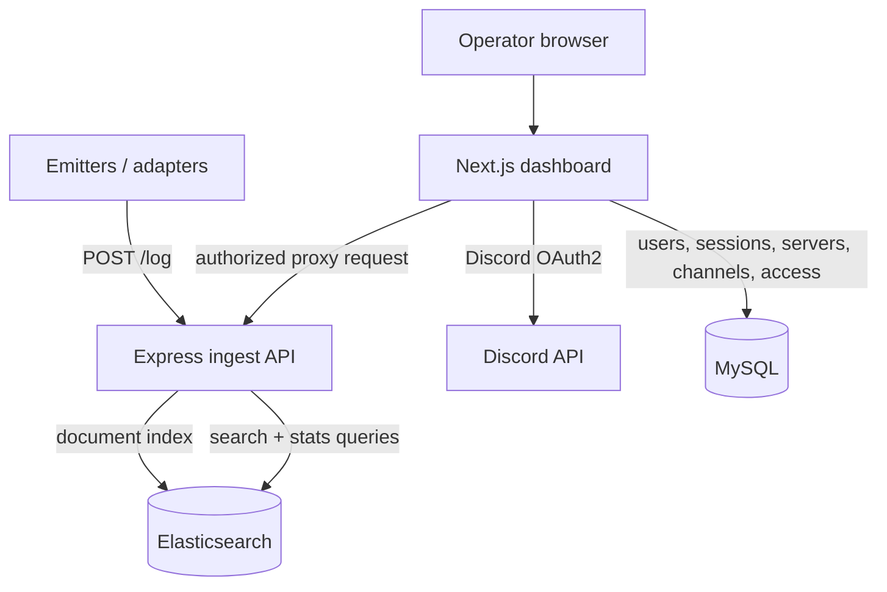

# Architecture

Elastic Telemetry is built around a blunt operational rule:

> The system being observed should spend almost no time thinking about telemetry.

The source runtime emits an event and gets back to work. The ingest API normalizes and indexes. Elasticsearch handles search and aggregation. MySQL handles users, sessions, servers, channels, and access mappings. Next.js sits in front as the authenticated control plane.

That is the architecture: move the expensive questions out of the runtime, keep the backend narrow, and put each datastore on the workload it actually fits.

## System Map

```mermaid
flowchart TD
    A[Emitters / adapters] -->|POST /log| B[Express ingest API]
    B -->|document index| C[(Elasticsearch)]
    B -->|search + stats queries| C

    D[Operator browser] --> E[Next.js dashboard]
    E -->|Discord OAuth2| F[Discord API]
    E -->|users, sessions, servers, channels, access| G[(MySQL)]
    E -->|authorized proxy request| B
```

## Runtime Edge: Emit And Leave

Runtime emitters capture useful local context:

- service or server name
- stable source identifier
- environment flag, such as production, staging, or development
- actor/user identifiers when the runtime has them
- event category and event type
- event-specific payload fields

Then the emitter sends JSON over HTTP. That is the right amount of work at the edge. The adapter enriches the event while the data is still cheap to know, but it does not index, aggregate, retry forever, or block the host runtime with database logic.

Failure mode: if the backend is unavailable, the observed runtime should continue. Telemetry loss is bad; taking down the system being observed is worse.

## Ingest API: Thin By Design

The backend is an Express service with four jobs:

- `POST /log` accepts telemetry, normalizes `event_type`, stamps `@timestamp` when missing, and indexes the document.
- `GET /search` builds structured Elasticsearch queries from filters and pagination parameters.
- `GET /stats`, `/stats/weapons`, and `/stats/vehicles` run aggregations where the indexed data already lives.
- `GET /meta/terms` returns discovered categories and event types from Elasticsearch terms aggregations.

The service boots the Elasticsearch index if it does not exist. The mapping locks down the fields the rest of the app depends on:

- `@timestamp` as `date`
- `event_type`, `category`, server IDs, player identifiers, and common payload keys as keyword/searchable fields
- `payload` as a dynamic object for event-specific metadata

That trade-off matters. Strict schemas are clean until every new event type needs a migration. Fully dynamic schemas are flexible until the dashboard cannot rely on anything. This mapping keeps the contract small and lets the payload breathe.

## Elasticsearch: The Hot Log Store

Elasticsearch owns the log workload because the workload is search:

- exact filters on license, event type, category, server, and dev-server flag
- date ranges over `@timestamp`
- fuzzy and prefix matching for player names
- full-text search across selected player, server, event, and payload fields
- bucket aggregations for category, event type, weapons, vehicles, daily trends, and unique players

The backend does not fetch a pile of documents and count them in JavaScript. Stats endpoints use `size: 0`, `terms`, `date_histogram`, `value_count`, `filter`, and `cardinality` aggregations. Less app code, less network transfer, better use of the engine that already has the index.

## MySQL: The Control Plane Store

MySQL is intentionally not the log sink. It stores structured state:

- `servers`
- `users`
- `sessions`
- `log_channels`
- `user_server_access`
- `server_admins`
- optional daily `weapon_stats` and `vehicle_stats` tables

That keeps user identity, sessions, server registration, channel configuration, and access rules in a relational model. The dashboard can answer "who can see this server?" with joins and unique constraints instead of asking a document index to impersonate an authorization database.

## Dashboard: Authenticated Query Broker

The browser never needs Elasticsearch credentials.

The Next.js dashboard handles Discord OAuth, creates JWT-backed sessions, stores Discord tokens in MySQL, and resolves the current user from cookies. API routes then enforce access before proxying search requests.

For server search, the route:

1. loads the current user
2. resolves the requested server by numeric ID or identifier
3. allows global admins and server admins/moderators
4. otherwise requires `user_server_access`
5. forwards the request to the backend with `server_id` forced to the resolved server identifier

That last detail is small but important. The frontend does not get to decide which server the backend searches just because it sent a query string.

## Security Boundary

Authentication proves who the user is. Authorization decides what telemetry they can query.

Current hard boundaries:

- dashboard routes require a valid session for protected data
- server search checks MySQL access before proxying
- Elasticsearch is not exposed directly to the browser
- backend query construction uses structured Query DSL objects

Current deployment boundary:

- `POST /log` is lightweight and does not currently enforce the `servers.api_key` column

So production deployments should keep ingest private, firewall it to trusted emitters, put it behind a reverse proxy with allowlists, or add API-key enforcement before public exposure. That is an intentional honesty point: high-volume ingest stays cheap, but public ingest needs a gate.

## Why The Split Holds Up

The source runtime emits and leaves. Express keeps the write path narrow. Elasticsearch handles the expensive read path. MySQL handles relational truth. Next.js enforces operator access before the query reaches the search backend.

It is not magic. It is boring separation of responsibilities applied to a loud telemetry problem, which is exactly why it works.
