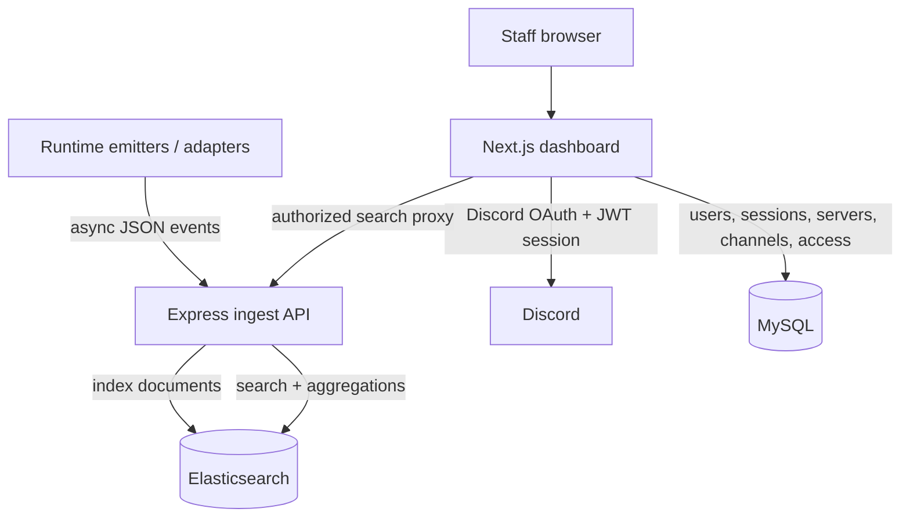

<div align="center">
  
  
  
  

  <br/>
  <br/>

  <h1>Elastic Telemetry</h1>
  <p>
    High-volume runtime logs, searchable in seconds, without making the source runtime do database work.
  </p>

  <p>
    <a href="#why-it-works">Why it works</a> •
    <a href="#architecture">Architecture</a> •
    <a href="docs/SETUP.md">Setup</a> •
    <a href="SHOWCASE.md">Showcase</a>
  </p>
</div>

---

## What This Is

Elastic Telemetry is a telemetry pipeline for noisy, semi-structured runtime events. Any process that can send JSON can use it: workers, backend services, automation jobs, edge runtimes, multiplayer servers, or custom adapters. The source runtime emits events, a small Node.js service indexes them, Elasticsearch does the heavy search work, and a Next.js dashboard gives operators a permission-aware control surface.

The impressive part is not that it stores logs. Plenty of systems store logs. The useful part is where the work happens:

- The source runtime only captures context and fires an async HTTP request.
- Node.js normalizes the event envelope and writes to Elasticsearch.
- Elasticsearch owns search, filtering, date ranges, fuzzy player lookup, and aggregations.
- MySQL owns structured state: users, sessions, servers, log channels, and access mappings.
- Next.js owns authentication and query proxying so the browser never gets raw Elasticsearch access.

That split is the whole trick. The hot path stays thin, the query path stays powerful, and operator permissions stay in a relational system that is good at relational state.

## Why It Works

- **Runtime cost moved to the edge, but not too much.** Emitters collect local context, attach server/service metadata, and post JSON. They do not try to search, aggregate, or persist locally.
- **The backend is deliberately small.** Express accepts `/log`, stamps `@timestamp` when needed, normalizes common `event_type` variants, and indexes one document into the configured Elasticsearch index.
- **Search is built from structured filters.** `/search` composes Elasticsearch Query DSL for licenses, event types, categories, server IDs, dev-server flags, date ranges, fuzzy player names, and broad text search across known payload fields.
- **Analytics run where the data lives.** Weapon, vehicle, category, event-type, daily trend, and unique-player stats use Elasticsearch aggregations instead of replaying logs through the app server.
- **Access control is not hidden in the UI.** Dashboard API routes load the current user from a JWT-backed session, check MySQL access tables, then proxy allowed queries to the backend with the server identifier forced into the request.
- **Dynamic payloads stay dynamic.** The Elasticsearch mapping pins the fields the system depends on, while `payload` remains `dynamic: true` for event-specific metadata.

## Architecture



The system is intentionally split into two backends:

- `backend/` is the fast path: ingest, search, metadata, and stats against Elasticsearch.
- `dashboard/` is the control plane: Discord OAuth, sessions, MySQL-backed access checks, admin screens, and operator UI.

See [ARCHITECTURE.md](ARCHITECTURE.md) for the deeper breakdown.

## What You Get

- Runtime adapter pattern for sending structured events from any service that can make HTTP requests.
- Client-agnostic JSON ingest endpoint for anything that can `POST /log`.
- Elasticsearch bootstrap mapping for timestamp, event type, category, server, player identifiers, and dynamic payload fields.
- Search endpoint with pagination, filters, fuzzy player-name matching, date ranges, and full-text query support.
- Stats endpoints for general activity, weapon usage, and vehicle usage.
- Next.js dashboard with Discord OAuth, JWT sessions, server access checks, admin routes, and log/channel management screens.
- Backend query endpoints protected by an internal key so browser traffic goes through Next.js access checks instead of talking to Elasticsearch-facing routes directly.

## Trade-Offs

This project chooses a thin ingest API over a heavyweight event broker. That keeps deployment simple and latency low, but it means extreme burst buffering belongs in infrastructure or a future queue layer.

It chooses Elasticsearch for log data and MySQL for application state. That is two datastores, but each one is doing the job it is good at: search-heavy documents in Elasticsearch, relational access control in MySQL.

The ingest route validates `x-telemetry-key` or `Authorization: Bearer ...` against the MySQL `servers.api_key` value and requires it to match the emitted `server.id`. Keep ingest private anyway; API keys reduce accidental exposure, they do not replace network boundaries.

## Setup

Start here:

- [docs/SETUP.md](docs/SETUP.md) for installation and environment configuration.
- [docs/API_REFERENCE.md](docs/API_REFERENCE.md) for ingest, search, metadata, and stats endpoints.
- [backend/database/README.md](backend/database/README.md) for the MySQL schema.

For a local full-stack run:

```bash
docker compose up --build
```

## Showcase

Browse the full dashboard gallery in [SHOWCASE.md](SHOWCASE.md).

<p align="center">
  
</p>
<p align="center">
  
</p>
<p align="center">
  
</p>
